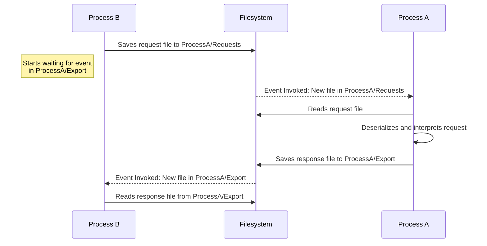
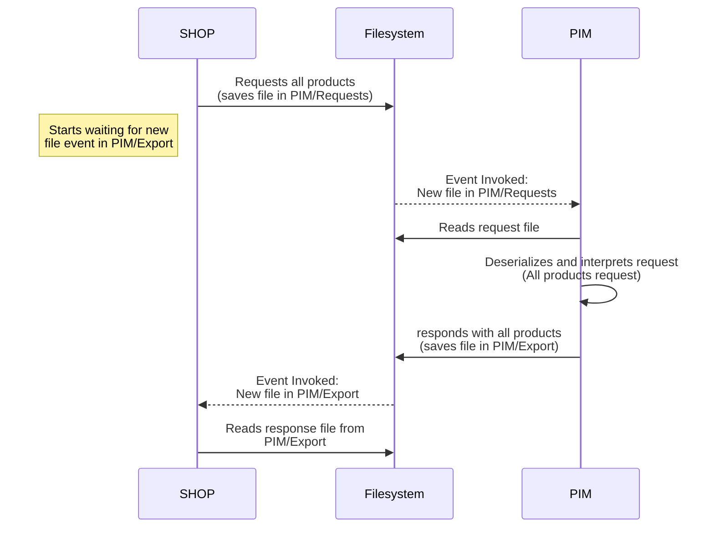

# Simple generic flow

```mermaid
  sequenceDiagram
    participant B as Process B
    participant FS as Filesystem
    participant A as Process A

    B->>FS: Saves request file to ProcessA/Requests
    Note left of B: Starts waiting for event<br/>in ProcessA/Export
    
    FS-->>A: Event Invoked: New file in ProcessA/Requests
    A->>FS: Reads request file
    A->>A: Deserializes and interprets request
    
    A->>FS: Saves response file to ProcessA/Export
    
    FS-->>B: Event Invoked: New file in ProcessA/Export
    B->>FS: Reads response file from ProcessA/Export
```

# PIM and SHOP example flow

```mermaid
  sequenceDiagram
    participant B as SHOP
    participant FS as Filesystem
    participant A as PIM

    B->>FS: Requests all products<br>(saves file in PIM/Requests)
    Note left of B: Starts waiting for new <br/>file event in PIM/Export
    
    FS-->>A: Event Invoked:<br>New file in PIM/Requests
    A->>FS: Reads request file
    A->>A: Deserializes and interprets request<br>(All products request)
    
    A->>FS: responds with all products<br>(saves file in PIM/Export)
    
    FS-->>B: Event Invoked:<br>New file in PIM/Export
    B->>FS: Reads response file from<br>PIM/Export
```
