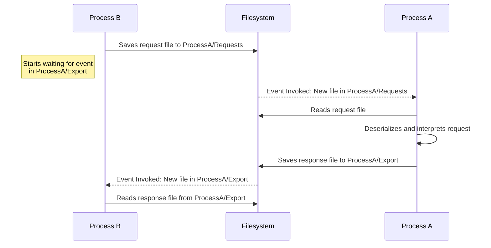

# FFFP - Fucking File Fetcher Protocol

This abselute stupid shitty protocol is made for transfering data between 2 processes, it was made to accomidate a abselutely fucking stupid requirement in a semester project

## Simple protocol flow

